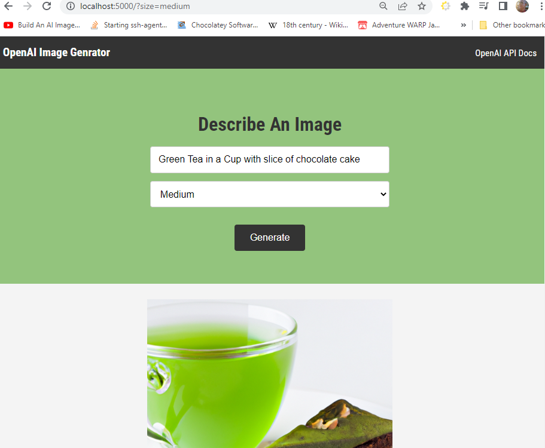
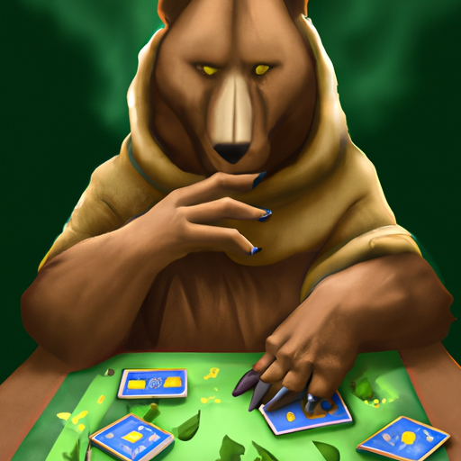

# OpenAI-based Image Generator app, Node.js

Node-based Open AI app. Generates images from natural language.

Full screenshot preview, on my local machine.

Test prompts were:

`Brown Bear Magic the Gathering`

Ouput was:

Then:

`Green Tea with chocolate cake slice`

and

`Green Tea in Cup with slice of chocolate cake`
